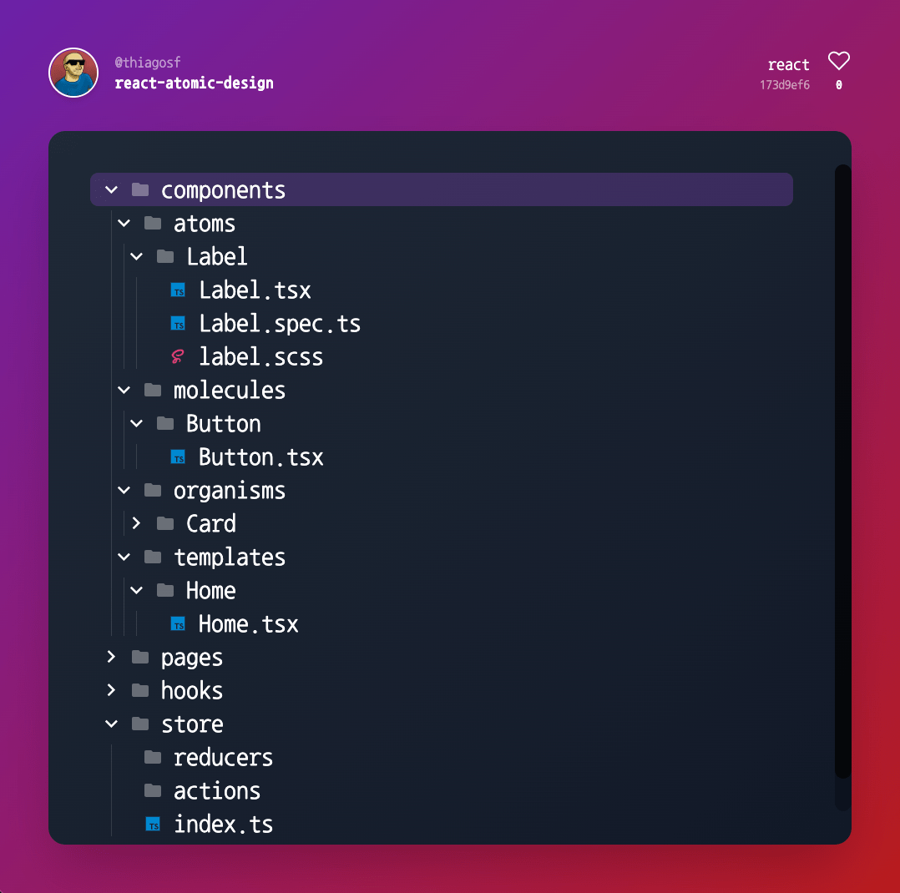

# <a href="https://www.stroo.app"></a>

Create interactive software structures.



## Motivation

This webapp was created to be used like a documentation for software structures and be easily shareable as best practices.

## Development

```bash
# install packages, just at the first time
docker-compose run web npm ci
docker-compose up
```

## Tests

```bash
docker-compose run web npm test
```

## TODO

- [ ] Increase TDD coverage
- [ ] Embed support
- [ ] Bash file with commands to create structure
